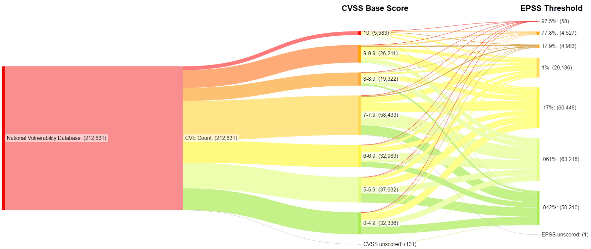

>[!NOTE]
>First, a big thank you to @patrickmgarrity who first created this and inspired me to want to recreate it and be able to easily reproduce it anytime to get fresh counts. His original post is on [LinkedIn Here](https://www.linkedin.com/posts/patrickmgarrity_vulnerabilitymanagement-riskmanagement-itsecurity-activity-7107083107790438400-pz8a).

------------------------------------------------

To create the CVSS/EPSS Sankey chart you need source data. For this project, we are using the NIST National Vulnerabilty Database and the [FIRST.org EPSS data](https://www.first.org/epss/data_stats). For the Sankey chart you will use https://sankeymatic.com.

Using this process, you should be able to easily generate all source data files and create fresh Sankey charts whenever you like.

### Steps:  
1. Download the National Vulnerability Database via API using the **getNVDdata-CSV.py** script
2. Download the EPSS data from [FIRST.org here](https://www.first.org/epss/data_stats) and click the "Download the data" button
3. Combine data from both files using the **combineEPSSdataWithNVD.py** script
4. Transform the combined data to the sankeymatic.com format
5. Copy/paste the data from the CSV file (except line 1) to sankeymatic.com

The end result should be this:




You can test the copy/paste of the data you should get in the resulting **sankey_data-DATE.csv** file by using the data in **[example_sankey_data_09222023.csv](/blob/main/example_sankey_data-09222023.csv)**.

--------------------------------------------------

### There are three (3) Python files provided in this repository:

1) **getNVDdata-CSV.py**
		
This will pull the entire national vulnerability database from NIST and put it into CSV format. Each API call pulls the maximum 2000 results and sleeps the loop for 6 seconds before continuing.

You will need your own NIST API key for this activity. At the bottom of the script add your API key in the API key section that looks like this:
						
```
# Replace with your actual API key
api_key = "<API KEY HERE>"
```
						
A CSV file will be generated in the same directory as the script and will have the current date appended to it.	It will look like **nvd-data-09222023.csv**.

--------------------------------------------------

2) **combineEPSSdataWithNVD.py**

This will take the NVD data CSV file and the EPSS data CSV file and combine them into a new file with the current date appended to it. It will look like **cvss-epss-data-DATE.csv**.

This is essentially doing a "vlookup" type Excel function to match the CVE's in the EPSS data and return the epss score value for that CVE. 

The script required the two source files be named when executed, like this:

```
combineEPSSdataToNVD.py nvd_data-09202023.csv epss_scores-2023-09-21.csv
```
	
If the source files are not named and launch, then the script will ask you for them.

--------------------------------------------------

3) **transformDataForSankey.py**

This transforms the **cvss-epss-data-DATE.csv** file data into a format that will work with Sankeymatic, including colors. The resulting file will be called **sankey_data-DATE.csv** and you can basically just copy all the data (except row 1) and paste it into sankeymatic.com. 

The script requires the source file to be named when executed, like this:

	```
	transformNVDdataForSankey.py --file cvss-epss-data-09212023.csv
	```

	If the source files are not named and launch, then the script will ask you for them.


